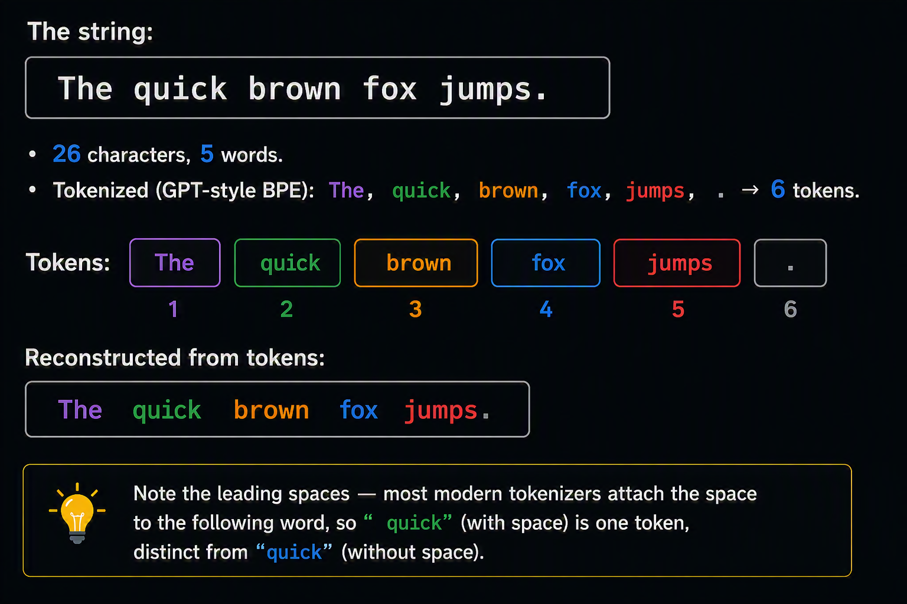

# LLM Latency Primer

A practical explanation of how LLM inference latency works, why Beatrice requests can feel slow on a developer laptop, and which levers actually matter.

## TL;DR

- Latency ≈ **(input tokens / prefill speed) + (output tokens / decode speed)**.
- Decode dominates; it is **serial** and **memory-bandwidth-bound**.
- Rough decode speed = **RAM bandwidth ÷ model size on disk**.
- On a typical DDR5 developer laptop, a Q4 3B model runs at ~15–40 tok/s, making a 150–300 token JSON response take 5–20 s — easily doubling under structured-output overhead or thermal throttling.
- **Shortening the output** and **using a smaller model in dev** are the highest-impact levers by far.

## The 2 Phases of LLM Inference

Every LLM request has two distinct phases with very different performance characteristics.

### 1. Prefill (a.k.a. "prompt processing" / "time to first token")

The model reads the entire prompt and computes its internal state (the KV-cache) for all input tokens. This is done **in parallel** — all input tokens can be processed in one big matrix multiplication because they are already known.

- **Cost:** roughly `O(input_tokens)` but heavily parallelizable.
- **Metric:** "prompt tokens/second" or "prefill throughput". On CPU for a 3B model: ~50–200 tokens/s. On a modern GPU: thousands to tens of thousands of tokens/s.
- **Observable as:** the delay before *any* output appears.

<details>
<summary>💡 Tokens are the model's own subword units produced by its "tokenizer".</summary>

- A tokenizer ([BPE](https://en.wikipedia.org/wiki/Byte-pair_encoding), [SentencePiece](https://github.com/google/sentencepiece), [tiktoken](https://github.com/openai/tiktoken), etc.) splits text into pieces that the model was trained on. These pieces are usually:
  - Short common words → 1 token, here are some examples:
    - the (1 token).
    - and (1 token).
    - cat (1 token).
  - Longer or rarer words → split into subwords, here are some examples:
    - tokenization → token + ization (2 tokens).
    - unbelievable → un + believ + able (3 tokens).
  - Punctuation and whitespace → usually their own tokens: ., ,, \n.
  - Non-English / non-Latin characters → often 1 token per character or worse (Chinese, Japanese, emoji can be 2–4 tokens per character).
- Each token maps to an integer ID in the model's vocabulary (typical size: 32k–200k IDs). The model literally operates on sequences of these integers, not on characters or words.
- Rough English rules of thumb
  - 1 token ≈ 3–4 characters of English text.
  - 1 token ≈ 0.75 words, or equivalently 100 tokens ≈ 75 words.
  - Code, JSON, and structured output are usually more token-dense (more tokens per character) because of punctuation, indentation, and repeated field names.
  - Non-Latin scripts are dramatically less efficient — the same sentence in Chinese or Arabic can cost 2–5× more tokens than English.



</details>


### 2. Decode (a.k.a. "generation" / "output tokens")

The model generates output **one token at a time**, autoregressively. Token `N+1` cannot start until token `N` is complete, because it depends on it.

- **Cost:** `O(output_tokens)`, fundamentally **serial** — no parallelism is possible within a single request.
- **Metric:** "output tokens/second" or "decode throughput". This is what people usually mean by "tokens/s".
- **Observable as:** the speed at which text streams out.

Total latency is therefore approximately:

```
latency ≈ (input_tokens / prefill_speed) + (output_tokens / decode_speed)
```

For a short prompt and a medium response, **decode dominates almost entirely**. Meaning, decode is the bottleneck and it is especially slow on CPU.

The critical insight: **decode is memory-bandwidth-bound, not compute-bound.** The limit is not how fast the CPU can multiply numbers — the limit is how fast the model's weights can be shovelled from RAM into the CPU's registers, once per token. Rough formula for decode speed:

```
tokens/second ≈ memory_bandwidth / model_size_in_bytes
```

Concrete numbers:

| Hardware                        | Memory bandwidth | 3B Q4 (~2 GB)  | 3B fp16 (~6 GB) |
| ------------------------------- | ---------------- | -------------- | --------------- |
| DDR4 laptop RAM                 | ~25–40 GB/s      | ~12–20 tok/s   | ~4–7 tok/s      |
| DDR5 laptop RAM (dual channel)  | ~60–90 GB/s      | ~30–45 tok/s   | ~10–15 tok/s    |
| Apple M-series (unified memory) | ~200–400 GB/s    | ~100–200 tok/s | ~30–60 tok/s    |
| RTX 4090 (GDDR6X)               | ~1000 GB/s       | ~500 tok/s     | ~150 tok/s      |
| H100 (HBM3)                     | ~3000 GB/s       | ~1500 tok/s    | ~500 tok/s      |

A typical developer laptop with DDR5 lands in the 60–90 GB/s range, so **~15–40 tok/s for a Q4-quantized 3B model** is realistic. Structured output overhead, fp16 weights, or thermal throttling can drop that back into the 5–20 tok/s range quickly.

## `WordExplanation` response

- 150–300 tokens for the `explainWord`.
- The output is a JSON object roughly like:
  ```json
  {
    "meaning": "...",               // ~40–80 tokens
    "simplifiedExplanation": "...", // ~30–60 tokens
    "synonyms": ["a", "b", "c"],    // ~15–40 tokens
    "antonyms": ["x", "y", "z"]     // ~15–40 tokens
  }
  ```

Plus JSON syntax (braces, quotes, commas, field names) which is another ~30–50 tokens of overhead. A token is roughly 3–4 characters of English, or one short word, or one punctuation mark.

Total: easily 150–300 tokens. At 15 tok/s that is 10–20 s. At 5 tok/s (worst case: thermal throttling on a laptop, or fp16 weights) that is 30–60 s.

Structured output also tends to generate **more tokens than necessary** because the schema forces the model to emit every field, in a specific order, with quoted keys, etc. — no shortcuts.
